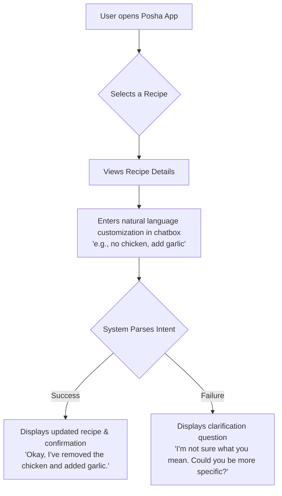

# Posha Recipe Customisation MVP

This document outlines the problem, proposed solution, and strategic thinking for a minimal viable capability that allows a Posha user to customize recipes using natural language.

---

## 1. The Problem & The User

* **User Persona:** "The Busy Professional." They invested in a Posha robot to save time and eat healthier, but they still want the flexibility to adapt meals to their family's specific tastes, dietary needs, or what's currently in their fridge.

* **The Core Problem:** Manually editing a recipe's steps and ingredient quantities is a high-friction process. Users need a way to make simple tweaks as effortlessly as talking to a chef.

* **The Goal:** To build a reliable "intent recognition" engine that translates a user's free-form request into a structured command the robot can understand, making the product feel more personal and intelligent.

---

## 2. The Proposed User Flow

This diagram illustrates the simple, conversational user journey for this new capability. The goal is to make recipe customization feel as natural as a quick chat.



## 3. Alignment with Posha's Business Goals

This feature is not just a user convenience; it's a strategic investment in Posha's core business model.

* **Increases User Retention:** By making the robot more personal and adaptable to daily needs, this capability increases the value of the "Posha Circle" subscription, which is key to reducing long-term churn.
* **Enhances Product Differentiation:** A powerful, intuitive conversational interface for recipes is a key differentiator against competitors like Thermomix and Suvie, reinforcing Posha's brand as the smartest, most user-friendly cooking robot on the market.
* **Creates a Data Moat:** Analysing user customization intents provides a valuable dataset on real-world user preferences, which can directly inform future recipe development and personalisation features.

---

## 4. MVP Scope & Prioritisation

The goal for this MVP was to deliver a simple, reliable, and valuable core experience. To achieve this, I ruthlessly prioritised the features that would solve the most common and high-value user problems first.

#### Intents Included in the MVP:

I chose to implement four core intents based on the most frequent and intuitive ways a user would want to customise a recipe:

* **`remove_ingredient`:** Solves for allergies and simple taste preferences (e.g., "no mushrooms").
* **`add_ingredient`:** Allows for simple personalisation (e.g., "add some onions").
* **`substitute_ingredient`:** A high-value intent that provides significant convenience (e.g., "use paneer instead of chicken").
* **`adjust_quantity`:** A critical intent for controlling taste and health preferences (e.g., "use less salt").

---

## 5. The JSON Schema Design

The architecture is composed of two core schemas: a `Recipe Schema` to define the recipe itself, and a `Customization Schema` to define the LLM's output. The design is compositional and extensible.

* **The Recipe Schema:** Defines a recipe as a sequence of discrete `actions` (e.g., "dispense", "cook") with specific `parameters` for each. This allows for maximum flexibility.
* **The Customization Schema:** Defines the LLM's response, including a `status` ("success" or "failure" with a reason) and an array of `customizations` that can be programmatically applied to the base recipe.

*(Full, detailed schema definitions and a complete example recipe JSON are available in the `json_design_schemas` folder.)*

---

### 6. How to Run This Demo

I have built both a live, interactive web demo for a quick review and provided instructions for running the project locally for a deeper dive.

#### Option 1: Live Interactive Demo (Recommended)

For the most convenient and interactive experience, the demo is deployed and accessible at the following link:

**Live Link:** **[https://posha-pm-assessment.vercel.app/](https://posha-pm-assessment.vercel.app/)**

#### Option 2: Running the Project Locally

To run the project on your local machine, please follow these steps:

1.  **Clone the Repository:**
    ```bash
    git clone https://github.com/Kavan2003/posha-pm-assessment
    cd posha-assignment
    ```

2.  **Create an Environment File:**
    Create a `.env` file in the root of the `posha-assignment` directory and add your Gemini API key:
    ```
    VITE_API_KEY="your_gemini_api_key_here"
    ```

3.  **Install Dependencies:**
    ```bash
    npm install
    ```

4.  **Run the Development Server:**
    ```bash
    npm run dev
    ```
    The application will now be running on `http://localhost:5173` (or the next available port).
---
## 7. Measuring Success

To determine if this minimal viable capability is successful, I would track the following metrics:

* **Adoption Rate:** % of user sessions that use the customization feature.
* **Task Success Rate:** % of customization attempts that result in a `"status": "success"` from the intent parser.
* **Qualitative Feedback:** Positive mentions of the feature in user feedback channels.

---
## 8. Limitations, Edge Cases & Roadmap

This MVP is a focused first step. Acknowledging its limitations is key to defining a clear and realistic roadmap for a more robust V2.

* **Complex Intent Handling (e.g., "Make it Vegetarian"):**
    * **Limitation:** The MVP intentionally does not handle broad, multi-step intents like "make it vegetarian."
    * **Reasoning:** A request like "remove chicken" is a single, simple action. A request like "make it vegetarian" is a complex command that requires a higher level of logic:
        1.  `REMOVE` the chicken.
        2.  `SUBSTITUTE` with a contextually appropriate protein (e.g., paneer, which the AI would have to infer).
        3.  `CHECK` if other ingredients (like white wine) are vegetarian-friendly.
        4.  Potentially `ADJUST` cooking times for the new ingredient.
    * **Roadmap (V2):** A future version would build a dedicated `dietary_preference` intent that can intelligently orchestrate these multiple steps.

* **No Culinary Validation:**
    * **Limitation:** The system currently trusts the user completely and does not perform a "recipe sanity check." A user can remove all ingredients, and the system will generate that intent.
    * **Reasoning:** The MVP's core job is to prove we can reliably translate natural language into a structured format. Culinary validation is a separate, complex problem requiring a sophisticated rules engine, which is out of scope for an initial build.
    * **Roadmap (V2):** Build a "Recipe Sanity Check" module to warn users about requests that might result in a broken or unpalatable dish.

* **No Downstream Logic:**
    * **Limitation:** This MVP is only responsible for parsing user intent. It does not calculate the downstream effects of a change, such as adjusting cooking times or temperatures.
    * **Roadmap (V2):** A separate "Recipe Engine" would be required to receive the JSON output and calculate these adjustments.

* **Ambiguity & Subjectivity:**
    * **Limitation:** The model will struggle with highly ambiguous requests like "make it healthier" or "make it taste better."
    * **Reasoning:** The goal of the MVP is to solve for clear, objective intents first. Handling subjective requests requires a more advanced clarification and dialogue management system.
    * **Roadmap (V2):** Build a clarification module that responds with questions like, "When you say 'healthier,' do you mean fewer calories or less salt?"

* **Quantity and Modifier Inference:**
    * **Limitation:** For ambiguous requests like 'add salt' or 'less pasta', the LLM makes a 'best-effort' guess at a reasonable quantity or modifier.
    * **Roadmap (V2):** A more sophisticated system would be needed to handle precise user preferences, potentially learning from past user choices.
* **No Process Modifications (e.g., Adjusting Cook Time):**
    * **Limitation:** The MVP only handles modifications to the `ingredients` list. It does not support requests to change the cooking process itself, such as "cook it for 5 more minutes."
    * **Reasoning:** Modifying the cooking process introduces significant downstream complexity (e.g., which `cook` step to alter, how it affects subsequent steps). To maintain a razor-sharp focus on the core capability of intent parsing, all process modifications were scoped out.
    * **Roadmap (V2):** A future version would introduce a new set of intents specifically for process modification, along with the necessary "Recipe Engine" logic to handle them.
* **Static Cooking Steps:**
    * **Limitation:** The MVP only modifies the `ingredients` list. It does not dynamically add or remove corresponding `steps`. For example, if a user removes "chicken," the "Dispense chicken" step will still exist in the output recipe, even though the chicken is no longer in the ingredient list.
    * **Reasoning:** The primary goal was to prove reliable intent parsing. Dynamically modifying the cooking steps is a separate "Recipe Engine" problem. To maintain a razor-sharp focus, this was intentionally scoped out.
    * **Roadmap (V2):** The "Recipe Engine" would be responsible for intelligently modifying the `steps` array—removing steps for removed ingredients and inserting new steps at the logically correct point for added ones.

### 9. A 2-Week Roadmap: Addressing All Limitations

This MVP is the essential first step. If I had two more weeks, my focus would be on a strategic sprint to systematically eliminate the MVP's core limitations and expand its capabilities to solve the user's end-to-end problem.


#### **Week 1: Building the "Intelligent Recipe Engine" & User Trust**

The primary goal of the first week is to build the core backend logic that makes true, intelligent customization possible.

* **Initiative 1: Build the Core Recipe Engine.**
    * **Limitation Addressed:** `Static Cooking Steps`, `No Culinary Validation`.
    * **Solution:** I would build a "Recipe Engine" module responsible for programmatically modifying the recipe's `steps` array. This engine would intelligently remove steps for discarded ingredients (e.g., removing the "Dispense chicken" step) and insert new steps at the logically correct point. It would also contain the initial "sanity check" logic to warn users about nonsensical requests (e.g., "remove all ingredients").

* **Initiative 2: Implement a "Confidence Score" & Clarification Module.**
    * **Limitation Addressed:** `Ambiguity & Subjectivity`.
    * **Solution:** I would enhance the LLM-powered service to include a "confidence score" with each parsed intent. If the score is low, the system would not execute the change but would trigger a clarification dialogue, asking the user a targeted question (e.g., *"By 'healthier,' do you mean fewer calories or less salt?"*). This builds immense user trust and prevents errors.

#### **Week 2: Expanding Capabilities & Solving the User's "Real" Problem**

The second week focuses on leveraging the new Recipe Engine to launch advanced features and connect the software to Posha's biggest strategic challenge.

* **Initiative 1: Launch Advanced Intent Handling.**
    * **Limitation Addressed:** `Complex Intent Handling`, `No Process Modifications`.
    * **Solution:** With the Recipe Engine in place, I would build handlers for complex, multi-step intents. A `dietary_preference` intent for "make it vegetarian" would now be able to correctly remove, substitute, and check ingredients. I would also introduce new intents for process modification (e.g., `adjust_cook_time`), which the engine would apply to the correct `cook` step in the recipe.

* **Initiative 2 (The Strategic Move): Prototype a Solution for the "Prep Problem."**
    * **Limitation Addressed:** This goes beyond the assignment to solve Posha's biggest user pain point.
    * **Solution:** I would **prototype an integration with a grocery API (like Instacart's).** When a user adds an ingredient they don't have, a new button would appear in the app: **"Add garlic to your Instacart basket?"** This is a lean, powerful experiment to test a transformative new value proposition. It connects this software feature directly to solving Posha's most significant strategic challenge, turning a simple customization tool into a true end-to-end meal planning solution.